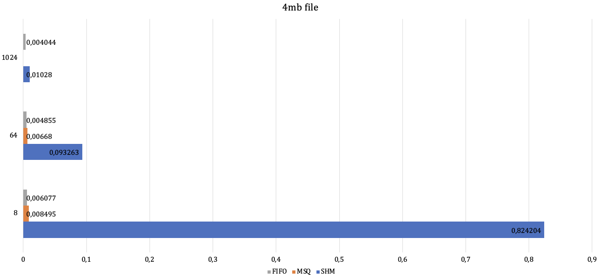

# Task 3. АНАЛИЗ РАЗЛИЧНЫХ IPC

 В данной таске я изучаю время передачи файлов с помощью таких IPC примитивов, как FIFO, Shared memory(SHM) и Message queue(MSQ).

 ## Результаты

 Измерения проводились для трех файлов с различным размером: 64kb, 4mb и 4gb. Помимо этого, учитывался размер буфера. Измерения проводились 
 на трех различных буферах: 
 * 8kb - малый буфер;
 * 64kb - буфер среднего размера, порядка размера буфера FIFO;
 * 4gb - буфер существенно большего размера, чем остальные.

Итоговые результаты для файла 64kb: 

для файла 4mb: 

для файла 4gb: 

 
## АНАЛИЗ 
Самый медленный способ передачи данных из тех, что получились у меня - это Shared memory ipc.
Как мы видим, для больших файлов общая память теряется из-за временных затрат на синхронизацию.
FIFO и Message queue показывают примерно одинаковые результаты, но # Task 3. АНАЛИЗ РАЗЛИЧНЫХ IPC

 В данной таске я изучаю время передачи файлов с помощью таких IPC примитивов, как FIFO, Shared memory(SHM) и Message queue(MSQ).

 ## Результаты

 Измерения проводились для трех файлов с различным размером: 64kb, 4mb и 4gb. Помимо этого, учитывался размер буфера. Измерения проводились 
 на трех различных буферах: 
 * 8kb - малый буфер;
 * 64kb - буфер среднего размера, порядка размера буфера FIFO;
 * 4gb - буфер существенно большего размера, чем остальные.

Итоговые результаты для файла 64kb: 

для файла 4mb: 

для файла 4gb: 

 
## АНАЛИЗ 
Самый медленный способ передачи данных из тех, что получились у меня - это Shared memory ipc.
Как мы видим, для больших файлов общая память теряется из-за временных затрат на синхронизацию.
FIFO и Message queue показывают примерно одинаковые результаты,с небольшими отклонениями в ту или иную сторону, однако FIFO был для меня более прост в реализации, чем MSQ.
